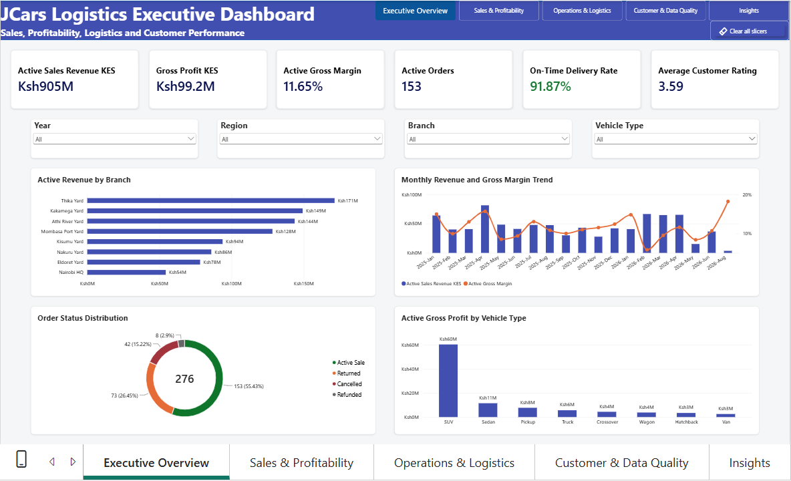
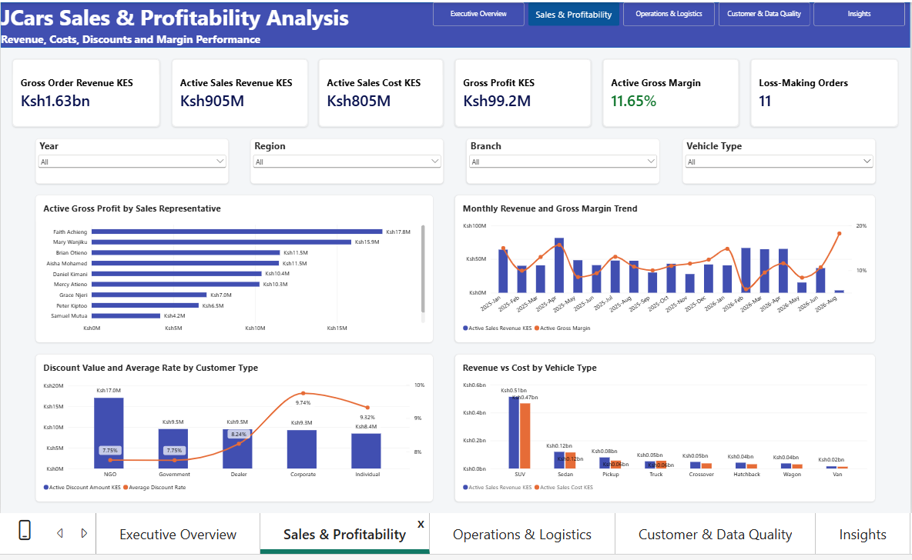
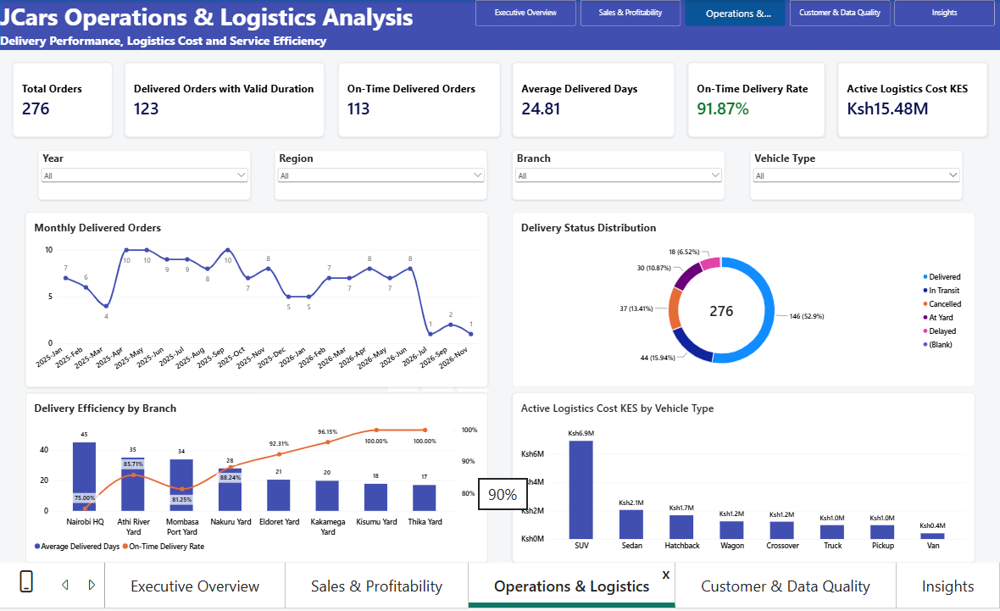
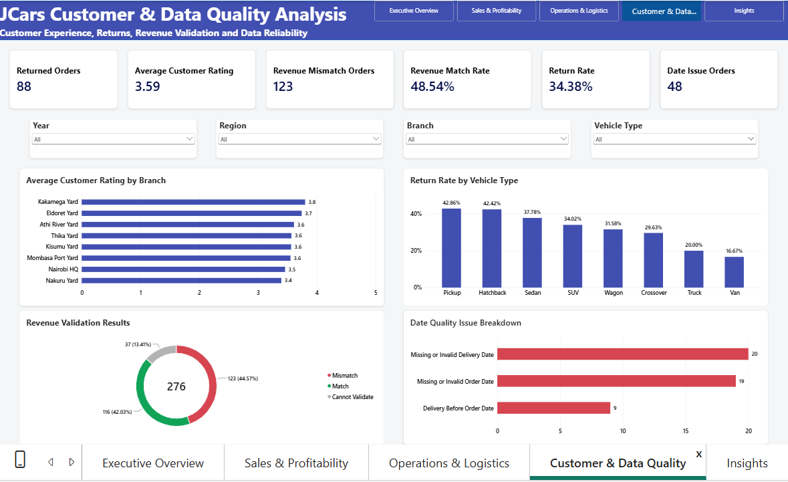
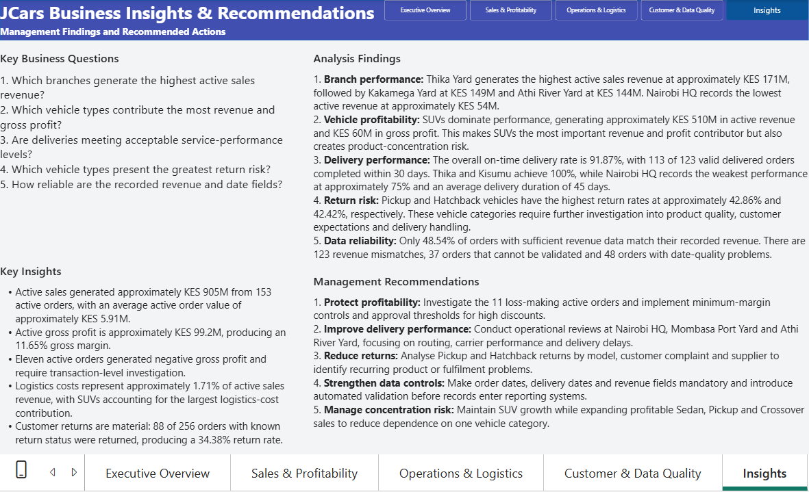
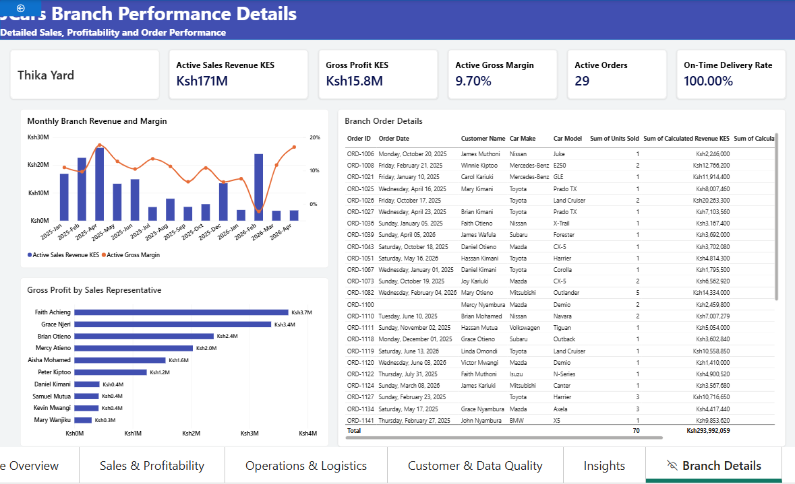

# JCars Logistics Power BI Business Intelligence Project

## Project overview

This project develops an end-to-end Power BI business intelligence solution for JCars Logistics, a vehicle sales and delivery business operating through branches in Kenya. The raw dataset contained commercial, customer, vehicle, payment, delivery, logistics, returns and customer-experience information, but it was not ready for reliable analysis.

The work covered data-quality investigation, Power Query cleaning, currency conversion, validation, dimensional modelling, DAX development, report design, interactivity, management insights and recommendations.

The final solution allows management to move from an executive overview into detailed sales, profitability, logistics, customer and data-quality analysis.

## Business objective

The project was designed to answer one central management question:

> How is JCars Logistics performing, where is it generating value, and which areas require management attention?

The analysis therefore focused on:

- Active sales revenue, costs, gross profit and margin.
- Branch, vehicle and sales-representative performance.
- Delivery speed and on-time performance.
- Logistics cost and operational efficiency.
- Returns, cancellations and refunds.
- Customer ratings and customer segments.
- Revenue and date-field reliability.
- Loss-making orders and other exceptions.

## Dataset

| Item | Description |
|---|---|
| Source file | `Jcars_data.csv` |
| Source records | 276 rows |
| Source fields | 32 columns |
| Analysis period | 2025 to 2026 |
| Reporting currency | Kenya shillings (KES) |
| Primary fact table | `FactSalesOrders` |

One source row was treated as one order record or order line associated with a customer, vehicle, branch, representative and delivery outcome. Because `Units Sold` can exceed one, an order row does not necessarily represent one vehicle.

`Source Row ID` was added as the stable audit key because the source `Order ID` field contained blanks, placeholders and duplicate values.

## Data-quality investigation

The source file contained no completely identical rows, but the column profile revealed extensive consistency, validity and completeness problems.

Major issues included:

1. Blank, placeholder and duplicated order identifiers.
2. Mixed order-date formats, including Excel serial numbers.
3. Mixed delivery-date formats and impossible calendar dates.
4. Delivery dates occurring before order dates.
5. Inconsistent customer-type labels.
6. Invalid, missing and inapplicable customer ages.
7. Region, county and city spelling variants.
8. Multiple labels for the same branch.
9. Misspelled and inconsistently formatted sales-representative names.
10. Lead-source synonyms and spelling variations.
11. Vehicle make and model inconsistencies.
12. Vehicle type, fuel, transmission and colour variants.
13. Invalid and future vehicle years.
14. Text, zero, negative and missing unit quantities.
15. Monetary values stored with different currency symbols and formats.
16. Mixed KES, USD, EUR and ZAR values.
17. Inconsistent discount formats.
18. Missing, negative, zero and inconsistent recorded revenue.
19. Fragmented payment and delivery status labels.
20. Invalid customer ratings and review counts.
21. Inconsistent returned indicators.

The project retained uncertain records and created quality classifications instead of silently deleting them.

## Power Query cleaning process

The original query was preserved as `Raw JCars Data`, with load disabled. A referenced staging query named `Stg JCars Data` contained the cleaning logic.

The cleaning process included:

- Adding `Source Row ID` from 1 to 276.
- Trimming and cleaning text fields.
- Converting supported blank and error markers to null.
- Standardising order identifiers.
- Cleaning customer names and mapping customer types.
- Parsing and validating customer ages.
- Standardising regions, counties, cities and branches.
- Correcting sales-representative and lead-source variations.
- Standardising vehicle make, model, type, year, fuel type, transmission and colour.
- Converting valid `Units Sold` values to whole numbers.
- Extracting currency, numeric amounts and million multipliers from monetary fields.
- Converting financial values to KES.
- Standardising discount values to decimal rates.
- Standardising payment method, payment status and delivery status.
- Parsing customer rating, review count and returned status.
- Parsing Excel serial dates and recognised text-date formats.
- Applying documented corrections to specific impossible dates.
- Creating calculated revenue, cost, gross profit and margin fields.
- Creating final transaction, date-validation and revenue-validation statuses.

### Row-level revenue calculation

```text
Calculated Revenue KES =
Units Sold × Unit Selling Price KES × (1 − Discount Rate)
+ Delivery Fee KES
```

This independent calculation was compared with `Revenue Recorded` to classify each order as `Match`, `Mismatch` or `Cannot Validate`.

## Date handling

The source contained Excel serials, month-name formats, slash-separated dates and impossible values such as `31/02/2026` and `April 31 2026`.

The main rules were:

- Parse Excel serial numbers as dates.
- Parse recognisable day, month-name and year formats.
- Correct an impossible end-of-month date only when another valid date supports the decision.
- Leave unsupported dates as null.
- Flag valid dates when the delivery date is earlier than the order date.
- Exclude invalid chronology from delivery-duration averages.

Examples of documented corrections include:

- `09-Sept-25` was parsed as `09/09/2025`.
- `April 31 2026` was corrected to `30/04/2026` where a valid related date supported the correction.
- `31/02/2026` was corrected to `28/02/2026` where sufficient evidence existed.
- Unsupported impossible dates with no related evidence were retained as null.
- Ambiguous slash dates were interpreted only where the delivery chronology supported the decision.

The final model identified 48 orders with date-quality issues.

## Currency standardisation

All monetary fields were converted to KES before aggregation.

| Currency representation | KES rate used | Treatment |
|---|---:|---|
| KES or KSh | 1.00 | Retained as KES |
| No currency label | 1.00 | Assumed KES as required by the assessment |
| USD or `$` | 130.00 | Converted to KES |
| EUR | 150.00 | Converted to KES |
| ZAR or `R` | 7.50 | Converted to KES |
| Question-mark prefix | 130.00 | Treated as USD as a documented dataset-specific assumption |

The fixed rates were used to keep the educational analysis reproducible. They are rounded project assumptions rather than transaction-date accounting rates.

The reasonableness reference was the [Central Bank of Kenya Foreign Exchange Rates](https://www.centralbank.go.ke/rates/forex-exchange-rates/) page, accessed on 23 September 2026. CBK publishes indicative daily rates based on average market buying and selling rates.

## Assumptions and business rules

- An active sale is a record whose `Final Transaction Status` is `Active Sale`.
- Returned, cancelled and refunded transactions are excluded from active-sales KPIs.
- An active loss-making order has calculated gross profit below zero.
- Delivery duration is calculated only when both dates are valid and delivery is not before the order date.
- An on-time delivery is a valid delivered order completed within 30 days.
- The return rate uses only orders with a known returned status.
- The revenue match rate excludes records that cannot be validated.
- Missing or uncertain values remain null or `Unknown` and are exposed through data-quality measures.

## Data model

The final model uses a compact star schema.

| Table | Rows | Purpose |
|---|---:|---|
| `FactSalesOrders` | 276 | Order-level sales, cost, delivery, return and quality facts |
| `DimDate` | 730 | Continuous calendar covering 2025 and 2026 |
| `DimBranch` | 8 | Standard branch and geographic attributes |
| `DimSalesRep` | 10 | Standard sales-representative names |
| `DimVehicle` | 35 | Vehicle make, model and type combinations |
| `_Measures` | N/A | Central table for explicit DAX measures |

Relationships use many-to-one cardinality and single-direction filtering from each dimension to the fact table.

- `FactSalesOrders[Order Date]` to `DimDate[Date]` is active.
- `FactSalesOrders[Delivery Date]` to `DimDate[Date]` is inactive and activated in delivery-date measures with `USERELATIONSHIP`.

## Selected DAX measures

```DAX
Total Orders =
COUNTROWS(FactSalesOrders)
```

```DAX
Active Orders =
CALCULATE(
    [Total Orders],
    FactSalesOrders[Final Transaction Status] = "Active Sale"
)
```

```DAX
Active Sales Revenue KES =
CALCULATE(
    SUM(FactSalesOrders[Calculated Revenue KES]),
    FactSalesOrders[Final Transaction Status] = "Active Sale"
)
```

```DAX
Active Gross Margin =
DIVIDE(
    [Active Gross Profit KES],
    [Profit Analysis Revenue KES]
)
```

```DAX
On-Time Delivery Rate =
DIVIDE(
    [On-Time Delivered Orders],
    [Delivered Orders with Valid Duration]
)
```

```DAX
Return Rate =
DIVIDE(
    [Returned Orders],
    [Orders with Known Return Status]
)
```

```DAX
Orders by Delivery Date =
CALCULATE(
    [Total Orders],
    USERELATIONSHIP(
        FactSalesOrders[Delivery Date],
        DimDate[Date]
    )
)
```

Additional measures cover revenue trends, year-to-date revenue, discounts, logistics cost, average order value, cancelled and refunded orders, loss-making orders, revenue validation and date reliability.

## Report pages

### Executive Overview



This page answers the high-level question, “How is JCars Logistics performing?” It presents active revenue, gross profit, margin, active orders, on-time delivery and average customer rating, supported by branch, monthly, transaction-status and vehicle comparisons.

### Sales and Profitability



This page investigates gross order revenue, active revenue, cost, gross profit, margin, loss-making orders, representative performance, discount behaviour and vehicle economics.

### Operations and Logistics



This page examines delivered orders, average delivery time, on-time performance, delivery status, branch delivery efficiency and logistics cost by vehicle type.

### Customer and Data Quality



This page combines customer ratings and returns with revenue and date-field validation, making data reliability visible to decision-makers.

### Insights



This page summarises the analyst-defined business questions, evidence-supported findings, key insights and management recommendations.

### Branch Details drill-through



Users can right-click a branch and drill through to its KPIs, monthly revenue and margin, representative performance and order-level records.

### Vehicle tooltip

The hidden tooltip page displays contextual vehicle revenue, gross profit, margin and return rate without overcrowding the main report pages.

## Interactivity

- Year, Region, Branch and Vehicle Type slicers are synchronised across the four analytical pages.
- Visuals cross-filter and cross-highlight related results.
- A Page Navigator connects all visible report pages.
- `Branch Details` provides a drill-through investigation experience.
- `Vehicle Tooltip` provides contextual analysis on hover.
- Hidden support pages are excluded from the normal user navigation.

## Final validated results

| KPI | Result |
|---|---:|
| Total orders | 276 |
| Active orders | 153 |
| Active sales revenue | Approximately KES 905.0M |
| Active sales cost | Approximately KES 804.7M |
| Active gross profit | Approximately KES 99.2M |
| Active gross margin | 11.65% |
| Average active order value | Approximately KES 5.91M |
| Delivered orders with valid duration | 123 |
| On-time delivered orders | 113 |
| On-time delivery rate | 91.87% |
| Returned orders | 88 |
| Return rate | 34.38% |
| Revenue mismatch orders | 123 |
| Revenue match rate | 48.54% |
| Date issue orders | 48 |
| Loss-making active orders | 11 |

## Key insights

1. Thika Yard generated the highest active revenue at approximately KES 171M, followed by Kakamega Yard at KES 149M and Athi River Yard at KES 144M. Nairobi HQ recorded approximately KES 54M.
2. SUVs dominated the portfolio with approximately KES 510M in active revenue and KES 60M in gross profit, creating both a strong contribution and concentration risk.
3. The overall on-time delivery rate was 91.87%. Thika and Kisumu reached 100%, while Nairobi HQ recorded about 75% and an average delivery duration near 45 days.
4. Pickup and Hatchback had the highest return rates at approximately 42.86% and 42.42%.
5. Only 48.54% of validateable orders matched recorded revenue. The model identified 123 mismatches, 37 orders that could not be validated and 48 date-quality issues.
6. Active sales generated approximately KES 905M from 153 orders, with an average order value near KES 5.91M.
7. Eleven active orders generated negative gross profit and require transaction-level review.

## Management recommendations

1. **Protect profitability.** Investigate the 11 loss-making active orders and introduce minimum-margin controls and approval thresholds for large discounts.
2. **Improve delivery performance.** Review routing, carrier performance and delay causes at Nairobi HQ, Mombasa Port Yard and Athi River Yard.
3. **Reduce returns.** Analyse Pickup and Hatchback returns by model, customer complaint, supplier and delivery handling.
4. **Strengthen data controls.** Make order date, delivery date, currency and revenue fields mandatory and validate them before records enter reporting systems.
5. **Manage concentration risk.** Maintain profitable SUV growth while developing profitable Sedan, Pickup and Crossover opportunities.

## Validation and quality assurance

The final solution passed the following tests:

- Successful model refresh without Power Query errors.
- Reconciliation of baseline KPI values with all slicers cleared.
- Year, Region, Branch and Vehicle Type slicer tests.
- Page navigation tests.
- Branch drill-through tests.
- Vehicle tooltip tests.
- Visual cross-filtering tests.
- Review of report, page and visual filters.
- Check for truncated titles, overlaps, unintended blanks and incorrectly formatted values.
- Confirmation that hidden support pages remain hidden.
- Review of the final exported PDF.

## Repository structure

```text
JCars-Logistics-Power-BI/
├── README.md
├── JCars_Logistics_Power_BI_Dashboard_Final.pbix
├── data/
│   └── Jcars_data.csv
├── documentation/
│   ├── JCars_Logistics_Power_BI_Final_Project_Documentation.pdf
│   └── JCars_Logistics_Data_Cleaning_and_Validation_Log.xlsx
└── screenshots/
    ├── executive-overview.png
    ├── sales-profitability.png
    ├── operations-logistics.png
    ├── customer-data-quality.png
    ├── branch-details.png
    └── insights-recommendations.png
```

## Tools used

- Microsoft Power BI Desktop
- Power Query M
- DAX
- Microsoft Excel for the cleaning and validation log
- GitHub for project documentation and versioned publication

## Author

**Jack Nimrod Kisutsa**

- [Portfolio](https://kisutsajack-ai.github.io/)
- [GitHub](https://github.com/kisutsajack-ai)
- [LinkedIn](https://www.linkedin.com/in/jack-kisutsa/)

## Project status

The Power BI report, project documentation, cleaning log, README and technical article draft are complete. GitHub upload, Dev.to publication and final submission-link verification remain publication steps.
